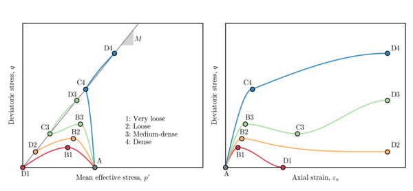

# share-pk-qss
Peak, quasi-steady state, and phase transformation values for a lot of simulations. 

## Global model settings

* Critical state line: Roscoe et al. (1958) [linear]
* Operational stress ratio: Extended Dafalias [symmetric]
* Loading: Triaxial compression
* Drainage: Undrained
* Maximum rate of dilatancy:
  * `D^p_min,tc = chi_i * psi_i`
  * `chi_i ~= chi_tc / (1 - lambda * (chi_tc / M_tc))` [Approximation]
* Hardening-softening law:
  * "Bonus" softening term included when `D^p > 0`

## Gloabl material parameters

| Parameter | Value  |
|-----------|--------|
| pref [Pa] | 1.0e+5 |
| Mtc       | 1.328  |
| Gamma     | 1.0709 |
| lambda    | 0.0225 |
| I_r       | 97.75  |
| n_e       | 0.79   |
| n_p       | 0.0    |
| psi_0     | varies |
| nu        | varies |
| N         | varies | 
| chi_tc    | varies |
| h_ref     | varies |

## Definitions

"Peak" (points B1, B2, or B3)
* `(p/pc)_pk` := normalized mean effective stress @ peak strength
* `(q/pc)_pk` := normalized deviatoric stress @ peak strength
* `(e*Ir)_pk` := normalized axial (or deivatoric) strain @ peak strength

"Quasi-steady state" (point C3)
* `(p/pc)_qss` := normalized mean effective stress @ quasi-steady state
* `(q/pc)_qss` := normalized deviatoric stress @ quasi-steady state
* `(e*Ir)_qss` := normalized axial (or deivatoric) strain @ quasi-steady state

"Phase transformation" (point C4)
* `(p/pc)_pt` := normalized mean effective stress @ phase transformation
* `(q/pc)_pt` := normalized deviatoric stress @ phase transformation
* `(e*Ir)_pt` := normalized axial (or deivatoric) strain @ phase transformation

> Note: Both points C3 and C4 have undergone "phase transformation". However, the subscript `_pt` is specifically used for cases where phase transformation occurs without reaching the quasi-steady state.
