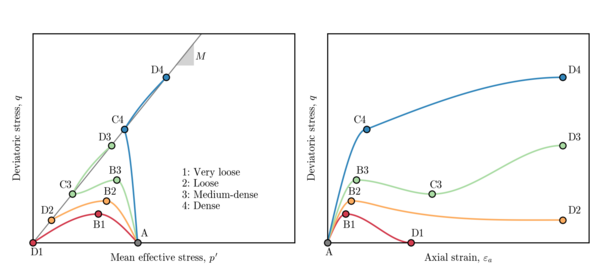

# share-pk-qss
Peak and quasi-steady state values for a lot of simulations. 


## Model settings

* Critical state line: Roscoe et al. (1958) [linear]
* Operational stress ratio: Extended Dafalias [symmetric]
* Loading: Triaxial compression
* Drainage: Undrained
* Maximum rate of dilatancy:
  * `D^p_min,tc = chi_i * psi_i`
  * `chi_i ~= chi_tc / (1 - lambda * (chi_tc / M_tc))` [Approximation]
* Hardening-softening law:
  * "Bonus" softening term included when `D^p > 0`


## Material parameters

| Parameter | Value  |
|-----------|--------|
| pref [Pa] | 1.0e+5 |
| Mtc       | 1.24   |
| Gamma     | 0.910  |
| lambda    | 0.014  |
| I_r       | 150.0  |
| n_e       | 1.0    |
| n_p       | 0.0    |
| psi_0     | varies |
| nu        | varies |
| N         | varies | 
| chi_tc    | varies |
| h_ref     | varies |

```python
psi_0  = np.linspace(-0.2, 0.2, 11)
nu     = np.linspace(0.1, 0.35, 6)
N      = np.linspace( 0.1, 0.6, 11)
chi_tc = np.linspace( 1.0, 6.0, 11)
h_ref  = np.logspace(np.log10(5), np.log10(150), 15)
```

> Total test: `6*11*11*11*15=119790`

> Logspace for `h_ref` gives nice distribution of `I_r/h_ref`


## Other notes

### File layout

| Response type       | ID | Col 0   | Col 1   | Col 2   | Col 3    | Col 4    | Col 5    |
|---------------------|----|---------|---------|---------|----------|----------|----------|
| Softening           | 0  |(p/pc)_pk|(q/pc)_pk|(e*Ir)_pk|(p/pc)_cs |(q/pc)_cs |(e*Ir)_cs |
| Quasi-steady state  | 1  |(p/pc)_pk|(q/pc)_pk|(e*Ir)_pk|(p/pc)_qss|(q/pc)_qss|(e*Ir)_qss|
| Monotonic hardening | 2  |(p/pc)_pt|(q/pc)_pt|(e*Ir)_pt|(p/pc)_cs |(q/pc)_cs |(e*Ir)_cs |

### Definitions


"Peak" (points B1, B2, or B3)
* `(p/pc)_pk` := normalized mean effective stress @ peak strength
* `(q/pc)_pk` := normalized deviatoric stress @ peak strength
* `(e*Ir)_pk` := normalized axial (or deivatoric) strain @ peak strength

"Quasi-steady state" (point C3)
* `(p/pc)_qss` := normalized mean effective stress @ quasi-steady state
* `(q/pc)_qss` := normalized deviatoric stress @ quasi-steady state
* `(e*Ir)_qss` := normalized axial (or deivatoric) strain @ quasi-steady state

"Phase transformation" (point C4)
* `(p/pc)_pt` := normalized mean effective stress @ phase transformation
* `(q/pc)_pt` := normalized deviatoric stress @ phase transformation
* `(e*Ir)_pt` := normalized axial (or deivatoric) strain @ phase transformation

"Critical state" (or "steady state") (points D1, D2, D3, or D4)
* `(p/pc)_cs` := normalized mean effective stress @ critical state (or steady state)
* `(q/pc)_cs` := normalized deviatoric stress @ critical state (or steady state)
* `(e*Ir)_cs` := normalized axial (or deivatoric) strain @ critical state (or steady state)


